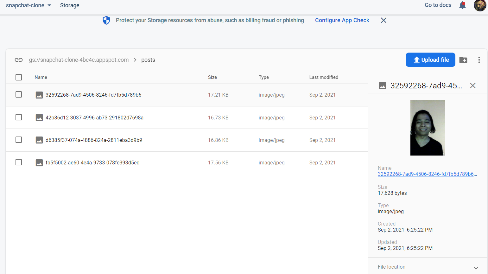

# snapchat-clone

This is my attempt to clone snapchat and I'm very proud of this project. Just like all of my projects, this one was incredibly difficult but I toughed it out and was able to get everything to work.

## Environment Setup

1. Clone my repo at https://github.com/davidmstanleyjr/snapchat-clone
2. CD into it and run 'npm install".
3. Then run npm start and this will open localhost:3000.
4. You will have to use your own firebase credentials.

## Technologies Used

1. React
2. CSS
3. Javascript
4. Material UI
5. Redux
6. Firebase
7. React Countdown Circle Timer
8. React Router
9. React Timeago
10. React Webcam
11. UUID

## Issues

This project presented me with a unique set of challenges.The first really hard part was figuring out the logic for the preview screen. When you use snapchat, you snap a pic and the screen shows you the still image before you click on someone to send it to. That logic was difficult to figure out. I ended up using useEffect and I wrote logic that said if there was currently no image, it would take me back to the homescreen.

I also had to give each user a unique identifier and for that I used UUID. This would collect the username of the person taking the snap and if the person chose to proceed with the snap, upload it to my database so it could be seen by the person it's being sent to. Then I used a countdown timer and wrote logic that made the snap disappear after 10 seconds.

Firebase gave me a lot of trouble this time. It's my my preferred database and I use it all the time, but there must have been a recent update because firebase was not being read by my project. I kept getting an error that said a firebase module was missing and all of my firebase imports were not coming through. I had to uninstall it and then install a slightly older version of firebase. Then my problem was solved.

I tried to use environment variables and a process.env file to hide my firebase config but firebase doesn't like that. I found out that the only way to use environment variables for firebase was through their CLI and it was very complicated so I decided against it.

The camera logic was tough as well because I had to access the mic and webcam of the user and then take the pic and it worked a bit differently than the Zoom app I did not too long ago. It was pretty straight forward after figuring it out.

The main reason I like Firebase isn't just because it's easy to use, but also because it allows me to do so many other things. I used Firebase for authentication in this project. This allowed the user to login using their Google account and I even pulled in their avatar. I also used firebase for the database to house user data, as well as storage, to hold the pics taken by the user. You can actually see the pics taken by the user in storage part of my firebase account.

## Screenshots

## Live Page

Here is a link to the deployed app https://davids-video-chat-clone.vercel.app/

## Quick Note

This project only works on computers. It doesn't work on phones.
